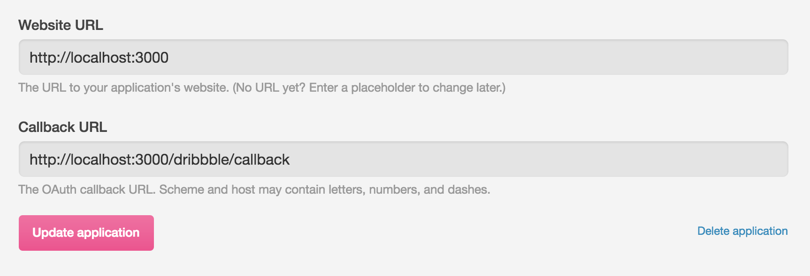
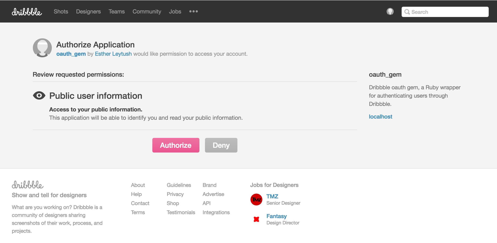

# rails-dribbble-oauth
A lightweight engine gem/plugin with no dependencies for authenticating users through Dribbble. Provides Dribble oauth calls to authenticate a given user, and receive back user's Dribbble information.

<hr>

## Installation
Add this line to your application's Gemfile:

```ruby
gem 'rails-dribbble-oauth'
```

And then execute:
```bash
$ bundle
```

Or install it yourself as:
```bash
$ gem install rails-dribbble-oauth
```

### Register your application with Dribbble and setup the callback

`rails-dribbble-oauth` adds routes to your applicationupon installation, visible via `rake routes`. The route setup is `[your root app]/dribbble/*`, where `*` is one of three possibilities: `request`, `callback`, and `information`.

To get started, register your application with Dribbble.
* Make a user account if you do not already have one.
* Navigate to  [dribbble.com/account/applications](https://dribbble.com/account/applications) to create your application's account.
* On the bottom of the page, click [Register a new application](https://dribbble.com/account/applications/new).
* Edit the `Website URL` and `Callback URL` portions. Include the `callback` route defined by the gem. This means your callback URL will be `http://[your root application URL]/dribbble/callback`:



As soon as your application is registered, you will see your `Client ID`, `Client Secret`, and `Client Access Token`. Copy the `Client ID` and `Client Secret` values: you'll need to echo those into your application's runtime environment in order to use the gem.

### Echo environment variables from Dribbble
Navigate to your application's environment shell. Run the following commands:

```bash
export DRIBBBLE_CLIENT_ID="[your application's Client ID]"
export DRIBBBLE_CLIENT_SECRET="[your application's Client Secret]"
```

Note: these environment variables must be named in this exact format.

### Build links in your root application
You're now ready to build links in your root application. Navigate to the views where you wish to authenticate users via Dribbble and build your links using the `dribbble_oauth_request_path` and passing it a user_id parameter:
```
<%= link_to "Dribbble authentication request", dribbble_oauth_request_path(user_id: @user.id) %>
```

### Get back user information from Dribbble
Add this line to your `ApplicationController`:

```
include RailsDribbbleOauth
```

Setup a new action in your `UserController`: `add_dribbble_info`. This action will be triggered once the Dribbble oauth request returns with information about the requesting user.

#### Program flow:
1. User clicks your link: `[your root app]/dribbble/request`.
2. User is served this page:



3. User clicks *Authorize*.
4. `rails-dribbble-oauth` handles getting user's info from Dribbble.
4. `rails-dribbble-oauth` redirects to your root application's `[base app]/users/add_dribbble_info` route with params containing the requesting user's information, such as in the following example. Note that `params[:user_id]` corresponds to your requesting user's ID in your application.

```ruby
{ "status"=>"200 OK",
  "success"=>"true",
  "user_id"=>"1",
  "user_data"=>{
    "avatar_url"=>"https://d13yacurqjgara.cloudfront.net/assets/avatar-default-aa2eab7684294781f93bc99ad394a0eb3249c5768c21390163c9f55ea8ef83a4.gif",
    "bio"=>"",
    "buckets_count"=>"0",
    "buckets_url"=>"https://api.dribbble.com/v1/users/1204942/buckets",
    "can_upload_shot"=>"false",
    "comments_received_count"=>"0",
    "created_at"=>"2016-06-03T14:11:25Z",
    "followers_count"=>"0",
    "followers_url"=>"https://api.dribbble.com/v1/users/1204942/followers",
    "following_url"=>"https://api.dribbble.com/v1/users/1204942/following",
    "followings_count"=>"0",
    "html_url"=>"https://dribbble.com/mindpl_ace",
    "id"=>"[some id]",
    "likes_count"=>"0",
    "likes_received_count"=>"0",
    "likes_url"=>"https://api.dribbble.com/v1/users/1204942/likes",
    "location"=>"",
    "name"=>"Esther Leytush",
    "pro"=>"false",
    "projects_count"=>"0",
    "projects_url"=>"https://api.dribbble.com/v1/users/1204942/projects",
    "rebounds_received_count"=>"0",
    "shots_count"=>"0",
    "shots_url"=>"https://api.dribbble.com/v1/users/1204942/shots",
    "teams_count"=>"0",
    "teams_url"=>"https://api.dribbble.com/v1/users/1204942/teams",
    "type"=>"User",
    "updated_at"=>"2016-06-03T14:11:50Z",
    "username"=>"mindpl_ace"}
}
```

<hr>

## Contributing
Please make PRs for any aspect of this service that you feel is lacking. You can also check out [open issues](https://github.com/mindplace/rails-dribbble-oauth/issues).

I appreciate any feedback, help, and contributions!

<hr>

## License
The gem is available as open source under the terms of the [MIT License](http://opensource.org/licenses/MIT).
